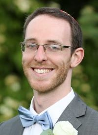

{: .float-left}
{: .px-6 }

Hi, I'm Raphael Elspas and I'm _curious about everything_. I've built weather satellites systems at NASA, designed wargame simulations at the John's Hopkins Applied Physics Lab, and now use AI to screen for structural heart diseases at [iCardio.ai](https://icardio.ai). I always wanted to share my love of learning and inspire others to find their inner curiosity, so I became a **master explainer**. 

Most recently I was an [adjunct professor at UMBC](teaching/umbc), and a teacher in the [MASA Israel Teaching Fellowship](https://www.masaisrael.org/program_cat/teach-english-en/). Leading informal education opportunities and inventing clever ways of teaching are at the heart of my passions and I hope to forever impact each of my students to help them discover what they can do best.

<!-- {: .d-md-inline-block .d-none } -->
Find out more about me by looking in the menu!

<!-- - [Tutoring](https://calendly.com/mathcs/45min)
- [Linkedin](https://www.linkedin.com/in/raphael-elspas-1ba0a34a)
- Resume/CV
- [Wikipedia](https://xtools.wmcloud.org/ec/en.wikipedia.org/Relspas)
- [Github](https://github.com/relspas)
- [Projects](projects)
- [Teaching](teaching)
- [Torah](torah)
- [Research](research) -->